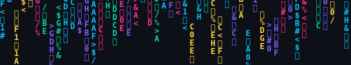

<pre>
╔════════════════════════════════════════╗
║   CLASSIFIED FILE — CLEARANCE: ROOT     ║
╠════════════════════════════════════════╣
║ CODENAME    : noa16-06                  ║
║ DESIGNATION : jr. developer             ║
║ STATUS      : ACTIVE                    ║
║ LOCATION    : ▓▓▓▓▓▓▓▓ [REDACTED]       ║
║ MISSION     : take it apart, find out   ║
║               how it works              ║
╚════════════════════════════════════════╝
</pre>

<strong>▸ boot log</strong>

<pre>
[00:00:01] booting homelab (ubuntu / fedora)...
[00:00:03] mounting /dev/curiosity...
[00:00:06] scanning known_hosts...
[00:00:09] loading interests: cybersecurity, networking, cryptography
[00:00:12] background_process: sports, music
[00:00:14] ACCESS: GRANTED
</pre>

<h3>skill matrix</h3>

  

  

<h3>secure comms</h3>

<h3>surveillance footage</h3>

&nbsp;

